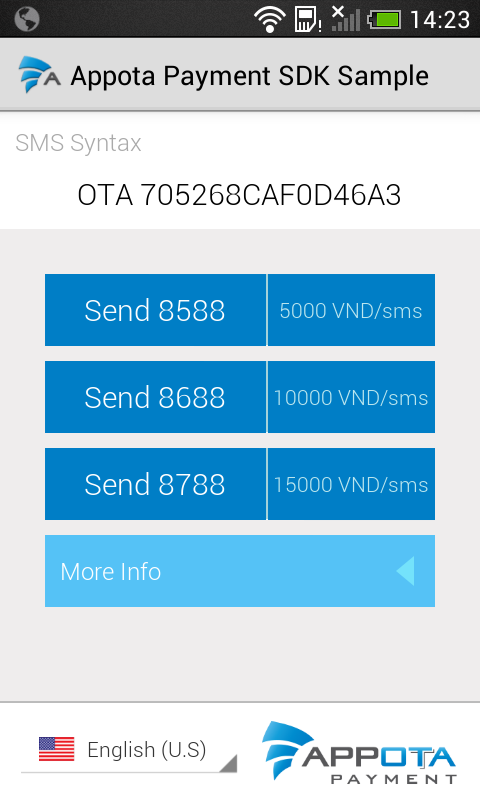

Other languages: [English](README_EN.md) | [Chinese](README_CN.md)

**Get Started**

Appota Payment SDK cho Android là cách đơn giản nhất để tích hợp thanh
toán cho ứng dụng của bạn trên hệ thống Appota. SDK này cung cấp giải
pháp cho các hình thức thanh toán: SMS, thẻ cào, internet banking,
Paypal và Google Play Payment.

**Các bước tích hợp SDK:**

​1. Import SDK vào project

​2. Cấu hình SDK

​3. Tích hợp

 

**1. Import SDK vào project**

Tải Appota Payment SDK cho Android và import vào IDE.

**2. Cấu hình SDK**

**Cấu hình \<AndroidMainfest.xml\>**

- Mở file \<AndroidMainfest.xml\> trong project Android của bạn.

- Thêm các dòng sau để cấu hình phân quyền:

```xml
<uses-permission android:name="android.permission.VIBRATE" />
<uses-permission android:name="android.permission.INTERNET" />
<uses-permission android:name="android.permission.WRITE_EXTERNAL_STORAGE" />
<uses-permission android:name="android.permission.ACCESS_NETWORK_STATE" />
<uses-permission android:name="com.android.vending.BILLING" />
```

- Để sử dụng giao diện thanh toán SMS, thêm cấu hình activity sau:

```xml
<activity android:name="com.appota.payment.SMSPaymentActivity" android:configChanges="orientation|keyboardHidden|screenSize" />
```

- Để sử dụng giao diện thanh toán thẻ cào, thêm cấu hình activity sau:

```xml
<activity android:name="com.appota.payment.CardPaymentActivity" android:configChanges="orientation|keyboardHidden|screenSize" android:windowSoftInputMode="adjustPan" />
```

- Để sử dụng giao diện thanh toán internet banking, thêm cấu hình activity sau:

```xml
<activity android:name="com.appota.payment.BankPaymentActivity" android:configChanges="orientation|keyboardHidden|screenSize" android:windowSoftInputMode="adjustPan" />
<activity android:name="com.appota.payment.ConfirmBankPaymentActivity" android:configChanges="orientation|keyboardHidden|screenSize" />
```
- Để sử dụng giao diện thanh toán Paypal, thêm cấu hình activity sau:

```xml
<activity android:name="com.appota.payment.PaypalPaymentActivity" android:configChanges="orientation|keyboardHidden|screenSize"
android:windowSoftInputMode="adjustPan" />
<activity android:name="com.appota.payment.ConfirmPaypalPaymentActivity" android:configChanges="orientation|keyboardHidden|screenSize" />
<service android:name="com.paypal.android.sdk.payments.PayPalService" android:exported="false" />
<activity android:name="com.paypal.android.sdk.payments.PaymentActivity" />
<activity android:name="com.paypal.android.sdk.payments.LoginActivity" />
<activity android:name="com.paypal.android.sdk.payments.PaymentMethodActivity" />
<activity android:name="com.paypal.android.sdk.payments.PaymentConfirmActivity" />
<activity android:name="com.paypal.android.sdk.payments.PaymentCompletedActivity" />
```
- Để sử dụng giao diện thanh toán Google Play Payment, thêm cấu hình activity sau:

```xml
<activity android:name="com.appota.payment.GooglePaymentActivity" android:configChanges="orientation|keyboardHidden|screenSize"/>
```
- Để tắt hoặc bật chế độ sandbox, thêm cấu hình sau:

```xml
<meta-data android:name="sandbox" android:value="false" />
```

**3. Tích hợp thanh toán**

Appota Payment SDK cung cấp lớp [AppotaPayment](docs/vn/AppotaPayment.html) đóng gói toàn bộ giao diện của từng hình thức thanh toán, để tích hợp bất cứ hình thức thanh toán nào chỉ cần gọi các hàm tương ứng được cung cấp sẵn.

**4. Chạy SDK Samples**

Bộ SDK cung cấp kèm theo một sample đơn giản để hướng dẫn bạn sử dụng Payment SDK. Để chạy sample, import project sample trong thư mục SDK vào
IDE, mở com.appota.paymentonlysample.MainActivity.

Bạn chỉ cần thay đổi *apiKey*và *sandboxApiKey* được hệ thống Appota cung cấp cho ứng dụng của bạn và chạy thử project, giao diện thanh toán
cho tất cả các hình thức sẽ hiện ra như dưới đây:

&nbsp;
&nbsp;
&nbsp;
&nbsp;
