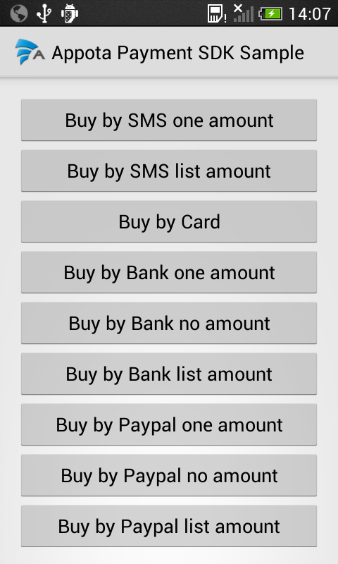
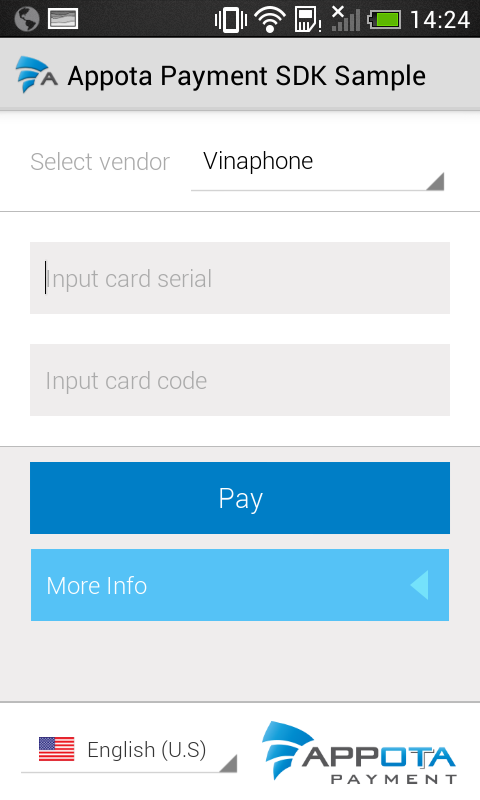
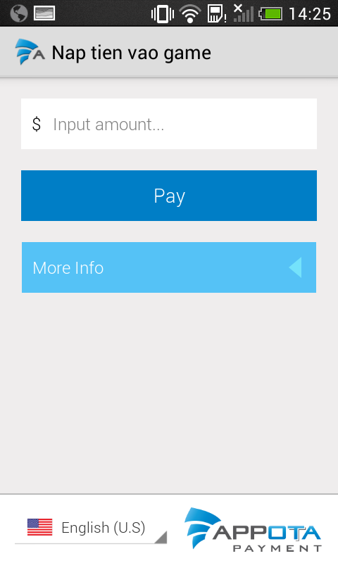

Other languages: [Vietnamese](README.md) | [Chinese](README_CN.md)

**Get Started**

Appota Payment SDK is the simplest way to integrate payment for your
application in Appota system. This SDK provides solutions for payment
methods such as: SMS, Card. Internet Banking, Paypal and Google Play
Payment.

**Steps to integrate SDK:**

​1. Import SDK into your project

​2. Configure SDK

​3. Integrate Payment

 

**1. Import SDK into project**

Download Appota Payment SDK for Android and import into IDE.

**2. Configure SDK**

**Configuration \<AndroidMainfest.xml\>**

- Open file \<AndroidMainfest.xml\> in your project Android.

- Add following lines to configure permission:

    <uses-permission android:name="android.permission.VIBRATE" />
    <uses-permission android:name="android.permission.INTERNET" />
    <uses-permission android:name="android.permission.WRITE_EXTERNAL_STORAGE" />
    <uses-permission android:name="android.permission.ACCESS_NETWORK_STATE" />
    <uses-permission android:name="com.android.vending.BILLING" />

- To use SMS payment interface, add following activity configuration:

    <activity android:name="com.appota.payment.SMSPaymentActivity" android:configChanges="orientation|keyboardHidden|screenSize" />

- To use Card payment interface, add following activity configuration:

    <activity android:name="com.appota.payment.CardPaymentActivity" android:configChanges="orientation|keyboardHidden|screenSize" android:windowSoftInputMode="adjustPan" />

- To use Internet Banking payment interface, add following acticity
configuration:

    <activity android:name="com.appota.payment.BankPaymentActivity" android:configChanges="orientation|keyboardHidden|screenSize" android:windowSoftInputMode="adjustPan" />
    <activity android:name="com.appota.payment.ConfirmBankPaymentActivity" android:configChanges="orientation|keyboardHidden|screenSize" />

- To use Paypal payment interface, add following activity configuration:

    <activity android:name="com.appota.payment.PaypalPaymentActivity" android:configChanges="orientation|keyboardHidden|screenSize"
    android:windowSoftInputMode="adjustPan" />
    <activity android:name="com.appota.payment.ConfirmPaypalPaymentActivity" android:configChanges="orientation|keyboardHidden|screenSize" />
    <service android:name="com.paypal.android.sdk.payments.PayPalService" android:exported="false" />
    <activity android:name="com.paypal.android.sdk.payments.PaymentActivity" />
    <activity android:name="com.paypal.android.sdk.payments.LoginActivity" />
    <activity android:name="com.paypal.android.sdk.payments.PaymentMethodActivity" />
    <activity android:name="com.paypal.android.sdk.payments.PaymentConfirmActivity" />
    <activity android:name="com.paypal.android.sdk.payments.PaymentCompletedActivity" />

- To use Google Play Payment interface, add following activity
configuration:

    <activity android:name="com.appota.payment.GooglePaymentActivity" android:configChanges="orientation|keyboardHidden|screenSize"/>

- To turn off or on Sandbox mode, add following configuration:

    <meta-data android:name="sandbox" android:value="false" />

**3. Integrate Payment**

Appota Payment SDK provides class [AppotaPayment](docs/en/AppotaPayment.md)
packaging all interfaces of each payment methods. To integrate any
payment methods, you just call respective functions given.

**4 - Run SDK Samples**

This SDK attachs a simple sample to instruct you to use Payment SDK. To
run sample, import project sample in folder SDK into IDE, open
com.appota.paymentonlysample.MainActivity.

You just change *apiKey*and *sandboxApiKey*provided by Appota for your
project and run trial project, payment interface for all methods will be
shown as following:

&nbsp;
&nbsp;
&nbsp;
&nbsp;
